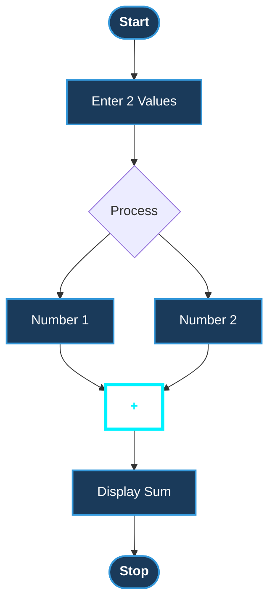

# Algorithm 

A clean, high-impact representation of computational logic and its real-world applications. This project breaks down the core concept of an **Algorithm** through a visual flowchart and practical examples.

---

## Logic Flowchart
> **Objective:** A step-by-step visual map of an addition operation.

# Application & real example

---

## What is an Algorithm?

> "An **algorithm** is a precise, *step-by-step set of instructions* designed to solve a specific problem or complete a task." 

---

## Real-World ex: Tea-Making

|  Step |  Action |  Technical Description |
| :--- | :--- | :--- |
| **01** | **Boil Water** | Initialize heat source; increase temperature to $100°C$. |
| **02** | **Add Tea Leaves** | Infuse the liquid medium with flavor particles. |
| **03** | **Add Milk & Sugar** | Input user preferences to modify the final state. |
| **04** | **Stir & Serve** | Execute final homogenization and deliver output. |

---
